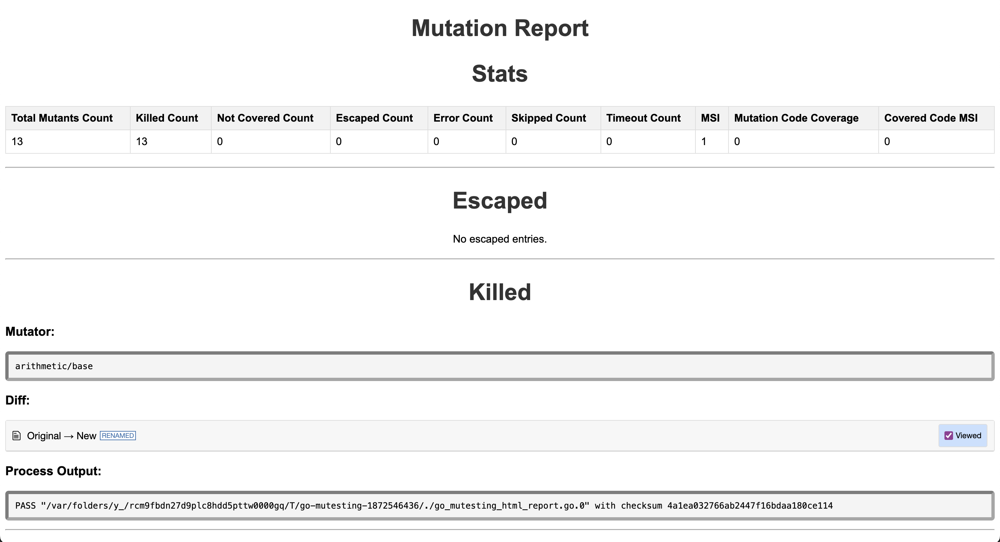

# Go Mutesting HTML Report Viewer



## To directly run the binary
### One time task: `cp ./go-mutesting-html-report $GOBIN`

```zsh
go-mutesting-html-report -file <PATH_TO_JSON_REPORT> -out <CUSTOM-REPORT-NAME>.html
```

> If you have trouble running on Mac os run: `xattr -d com.apple.quarantine $GOBIN/go-mutesting-html-report`

> Ignore the -file if the file named "report.json" is present in the current directory

> Ignore the -out if you don't want to customise the output file. Default "report.html" will be generated in the current directory.


## To run locally
```zsh
go run go_mutesting_html_report.go -file <PATH_TO_JSON_REPORT> -out <CUSTOM-REPORT-NAME>.html
```
> Ignore the -file if the file named "report.json" is present in the current directory

> Ignore the -out if you don't want to customise the output file. Default "report.html" will be generated in the current directory.

### Features
- View Diff with changes highlighted line-by-line
- Mark as Viewed and collapse the same

### Upcoming features
 - Filter
 - Enhanced UI / UX
 - Compare Reports

### Dependencies
- [diff2html](https://diff2html.xyz)